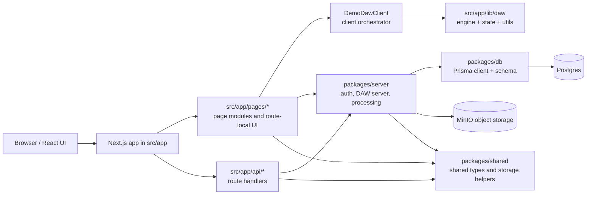

# Codebase Architecture

This repository is a monorepo centered on a Next.js web app with a DAW-focused collaboration backend.
The code is split into a few clear boundaries:

- `src/` holds the web app, routes, and client-side DAW experience.
- `packages/db/` holds Prisma schema and the shared Prisma client singleton.
- `packages/server/` holds server-only auth, DAW command handling, snapshotting, realtime, and processing logic.
- `packages/shared/` holds shared types, storage helpers, queue contracts, and API payload shapes.
- `docs/` holds architectural notes and operating docs.

## System View

## Top-Level Layout

| Path | Role |
|---|---|
| `src/app` | Next.js app router entrypoints, global layout, and route handlers |
| `src/app/pages` | Route-local page modules, layouts, and UI composition code |
| `src/app/lib/daw` | Client-side DAW feature code |
| `packages/db` | Prisma schema, client, and database migrations |
| `packages/server` | Server-side auth, DAW domain logic, realtime, and background jobs |
| `packages/shared` | Shared enums, request/response shapes, and storage/queue helpers |
| `docs/architecture` | Focused architecture notes for specific subsystems |

## Routing Model

The app uses a split between thin Next.js entrypoints and feature modules:

- `src/app/layout.tsx` and `src/app/pages/layouts/root-layout.tsx` define the global shell.
- `src/app/page.tsx` redirects the root path to `/groups`.
- `src/app/login/page.tsx` and `src/app/signup/page.tsx` re-export auth page modules.
- `src/app/groups/...` contains the public Next route files.
- `src/app/api/.../route.ts` contains Next route handlers.
- Many API routes simply re-export implementation modules from `src/app/pages/api/...`.

That means the actual page and request logic mostly lives under `src/app/pages`, while `src/app/*` stays thin and route-shaped.
`src/app/pages/api` is a feature directory for route implementations, not the Next.js pages router.

### Main UI Routes

| Route | Responsibility |
|---|---|
| `/` | Session check, then redirect to `/groups` |
| `/login` | Login page |
| `/signup` | Signup page |
| `/groups` | Authenticated group list |
| `/groups/[groupId]` | Group detail, members, and projects |
| `/groups/[groupId]/projects/[projectId]` | Project detail and demos |
| `/groups/[groupId]/projects/[projectId]/demos/[demoId]` | DAW workspace |

### Workspace Refresh

The group and project shells use a separate realtime lane from the DAW editor itself:

- `/groups` subscribes to `/api/groups/realtime`
- `/groups/[groupId]` subscribes to `/api/groups/[groupId]/realtime`
- `/groups/[groupId]/projects/[projectId]` subscribes to `/api/groups/[groupId]/projects/[projectId]/realtime`

Those endpoints stream `workspace_changed` events from `packages/server/app/lib/workspace-realtime.ts`.
The client-side hook debounces the signal and calls `router.refresh()` so new groups, projects, demos, and membership changes appear without a manual reload.

## DAW Client Architecture

The DAW experience is concentrated in two places:

- `src/app/pages/groups/demo/components/daw`
- `src/app/lib/daw`

### UI Composition

`DemoDawClient` is the client-side orchestrator. It wires together:

- transport and playback controls
- timeline and ruler rendering
- track lanes and clips
- version history tree
- recording and upload flows
- comments and annotations
- project sync and optimistic updates

The supporting components are kept near the demo page so the DAW UI stays feature-local.

### Client-Side Feature Layers

| Area | Responsibility |
|---|---|
| `engine/` | Playback, ingest, editing, local cache, waveform cache, and project sync |
| `state/` | Local project state, reducers, selectors, drag state, queue state, and UI state |
| `rendering/` | Timeline and waveform projection helpers |
| `utils/` | Pure timing, segment, recording-bound, and version-label helpers |
| `hooks/` | DAW-specific React hooks such as comment loading |

The flow is:

1. The server-rendered demo page loads the initial project data.
2. `DemoDawClient` boots `ProjectSyncEngine`.
3. `ProjectSyncEngine` loads local cache, calls the bootstrap endpoint, and subscribes to realtime updates.
4. Accepted operations are applied through `operation-reducer`.
5. The UI renders from `LocalProjectState`, not from stale props.

This is the main state-management boundary in the app.

## Server Architecture

`packages/server` is the authoritative backend domain layer.

### Subsystems

| Subsystem | Role |
|---|---|
| `app/lib/auth` | Session cookie handling, password hashing, request auth helpers |
| `app/lib/daw/protocol` | Shared DAW command and event contracts |
| `app/lib/daw/server/commands` | Create/update command handlers for demos, tracks, segments, and versions |
| `app/lib/daw/server/snapshot-builder` | Bootstrap payloads, snapshots, operation tails, and replay data |
| `app/lib/daw/server/versioning` | Copying and branching demo versions |
| `app/lib/daw/server/demo-user-active-version` | Per-user active checkout state |
| `app/lib/daw/server/realtime-gateway` | In-memory realtime pub/sub for accepted operations and presence |
| `app/lib/workspace-realtime` | In-memory SSE pub/sub for group, project, and demo list refreshes |
| `app/lib/daw/server/assets` | Signed upload/download URLs and upload completion |
| `app/lib/daw/server/jobs` | Processing-job creation and orchestration |
| `app/lib/processing` | Generic processing job queue abstraction |

### DAW Request Flow

The DAW backend follows a command/snapshot/realtime pattern:

- bootstrap endpoints load a durable snapshot plus an operation tail
- command endpoints validate auth and write through server command handlers
- successful writes create operation log records, update snapshots/checkpoints when needed, and emit realtime events
- the client listens for `accepted_operation` and other events to stay in sync
- surrounding group/project pages refresh through the workspace SSE lane when their data changes

## Persistence Model

`packages/db/prisma/schema.prisma` defines the durable domain model.

### Core Entities

- Identity and collaboration: `User`, `Group`, `GroupMember`, `Notification`
- Project hierarchy: `Project`, `Demo`, `DemoVersion`
- Audio timeline model: `Track`, `TrackVersion`, `Segment`
- Realtime and checkout state: `DemoUserActiveVersion`
- Comments and notes: `Comment`, `Annotation`, `LyricSegment`
- History and replay: `ProjectOperationLog`, `ProjectSnapshot`
- Media and processing: `AudioAssetMetadata`, `ProcessingJob`
- Extras: `EquipmentItem`, `ProjectEquipmentRequirement`, `PluginMetadata`

`packages/db/src/index.ts` exports the Prisma client singleton and Prisma types so app code can share one database access point.

## Shared Contracts

`packages/shared` keeps cross-cutting types that do not belong to only the browser or only the server:

- storage path helpers for audio assets
- queue message and job payload types
- API request and response shapes
- shared enums for timing, upload choices, processing jobs, and asset kinds

This package is the handoff layer between browser code, server code, and external workers.

## Storage And Processing

Audio assets are stored by stable ID-based paths, not by mutable names.

Typical object keys look like:

`projects/{projectId}/demos/{demoId}/tracks/{trackId}/versions/{trackVersionId}/...`

Derived media is split by purpose:

- `originals`
- `derived`
- `peaks`
- `transcripts`
- `stems`
- `analysis`

This matters because `TrackVersion.storageKey` is treated as the source of truth for the exact object to load.
Browser-facing audio playback should use the same-origin audio route rather than the raw storage key.
The durable key still identifies the object in storage, but the browser should reach it through the audio proxy so it receives regular HTTP audio bytes.

## Architectural Rules Of Thumb

- Keep route entrypoints thin.
- Put feature logic in `src/app/pages` or `packages/server`, not in route files.
- Keep DAW state derivations pure where possible.
- Treat `LocalProjectState` as the live render model for the DAW UI.
- Treat the Prisma schema and object storage keys as durable identifiers, not display names.

## Related Notes

This document is the top-level map. More focused notes live in:

- `src/app/lib/daw/README.md`
- `docs/architecture/daw-realtime-sync.md`
